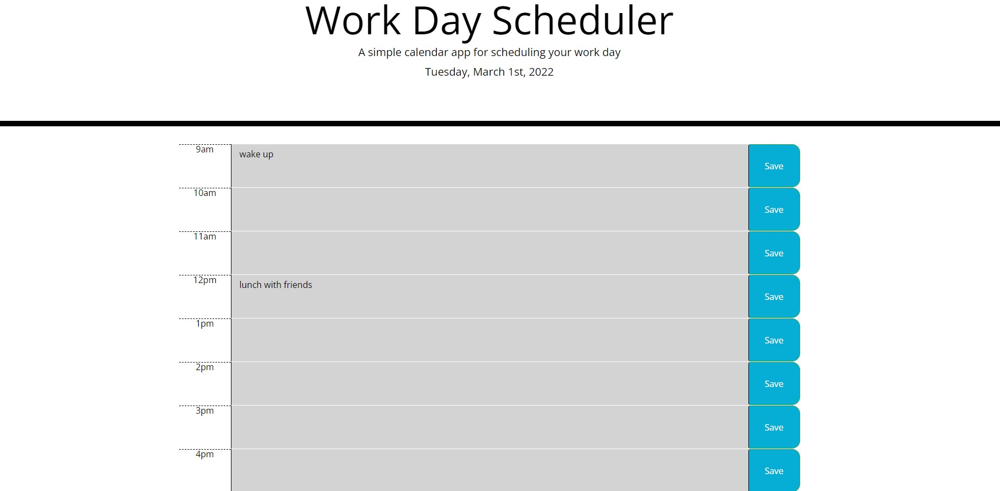

# Work Day Scheduler
## Description
A simple calendar application that allows a user to save events for each hour of the work day.  
Built with:
- HTML
- CSS
- Bootstrap
- JavaScript
- jQuery
- Moment.js

## Link to Deployed Application
https://kaiafay.github.io/workday-scheduler/ 

## Mock Up

